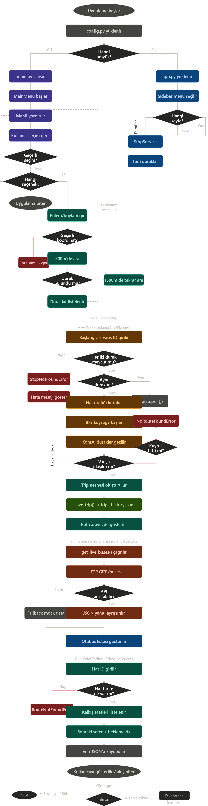
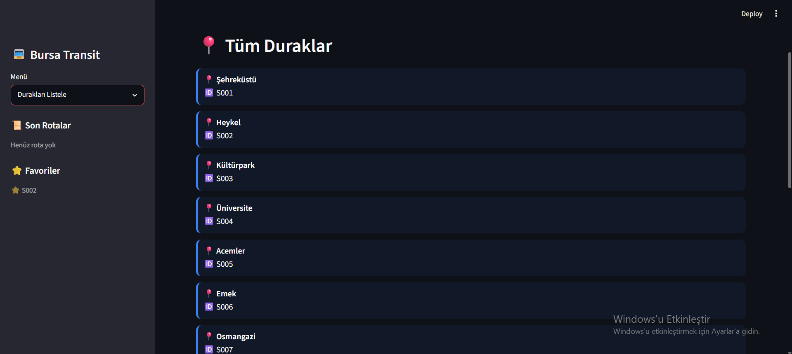
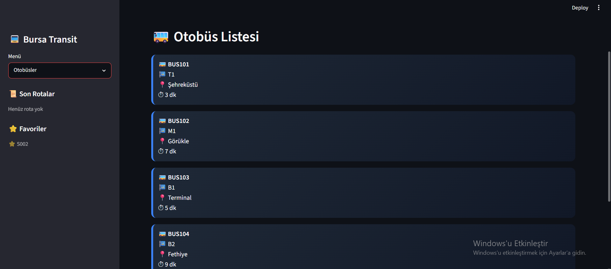
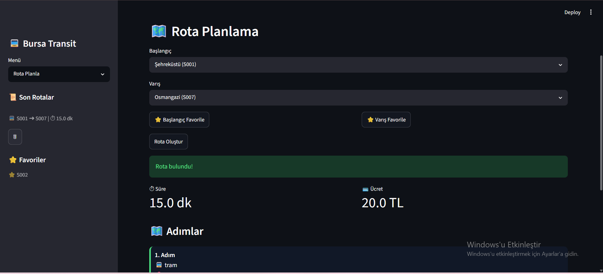
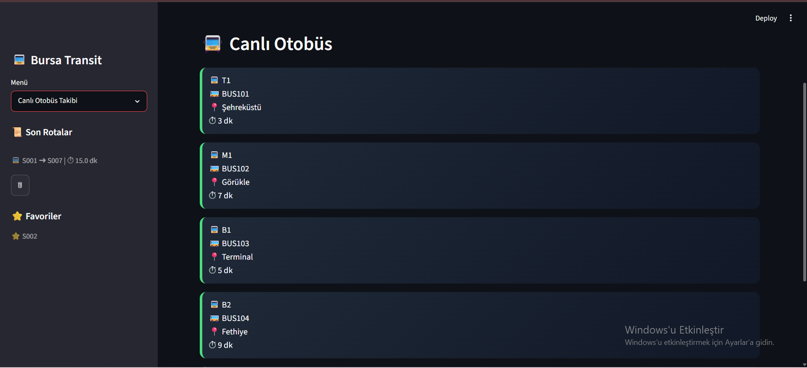

# Bursa Transit App

Bursa toplu taşıma sistemi için geliştirilmiş akıllı rota planlama ve otobüs takip uygulaması.
Otobüs, metro ve tramvay hatlarını kapsayan BFS algoritması ile en kısa rota hesaplanır.
Streamlit web arayüzü ve CLI (komut satırı) olmak üzere iki farklı arayüz sunar.

## Özellikler

- Tüm durakları listeleme
- Otobüs listesi ve tahmini varış süresi (ETA)
- BFS algoritması ile rota planlama (çoklu mod: otobüs + metro + tramvay)
- Canlı otobüs takibi (API yoksa otomatik mock veriye geçer)
- Favori durak kaydetme
- Son rota geçmişi ve silme
- CLI arayüzü: yakın durak bulma, hat detayı, sefer tarifesi, ayarlar

## Algoritma Akış Şeması



## Ekran Görüntüleri

| Duraklar | Otobüsler |
|----------|-----------|
|  |  |

| Rota Planlama | Canlı Takip |
|---------------|-------------|
|  |  |

## Kurulum

```bash
# 1. Repoyu klonla
git clone https://github.com/esma-hjb/bursaray-transit-app.git
cd bursaray-transit-app

# 2. Sanal ortam oluştur (önerilen)
python -m venv .venv

# Windows
.venv\Scripts\activate

# macOS/Linux
source .venv/bin/activate

# 3. Bağımlılıkları kur
pip install -r requirements.txt
```

## Çalıştırma

**Web arayüzü (Streamlit):**
```bash
streamlit run app.py
```
Tarayıcıda otomatik açılır → http://localhost:8501

**Komut satırı (CLI):**
```bash
python main.py
```

**Testler:**
```bash
pytest
```

## Proje Yapısı
## Proje Yapısı
bursaray-transit-app/

├── app.py                  # Streamlit web arayüzü

├── main.py                 # CLI giriş noktası

├── config.py               # Genel ayarlar ve sabitler

├── models/                 # Veri modelleri (Stop, Route, Trip, UserPrefs)

├── repositories/           # Veri erişim katmanı (JSON okuma/yazma)

├── services/               # İş mantığı (rota planlama, durak sorgulama)

├── cli/                    # Komut satırı arayüzü

├── storage/                # JSON kalıcılık katmanı

├── utils/                  # Yardımcılar (geo, validator, logger, exceptions)

├── api/                    # Mock Flask API sunucusu

├── data/                   # Veri dosyaları (stops, routes, schedule)

├── tests/                  # Pytest testleri (13 test)

└── screenshots/            # Uygulama ekran görüntüleri
## Teknik Detaylar

- **Dil:** Python 3.10+
- **Python:** 3.12 ile test edilmiştir
- **OOP:** Stop, Route, Trip, TripStep, UserPrefs, Repository, Service sınıfları
- **Algoritma:** BFS (Breadth-First Search) ile en kısa rota
- **Veri kalıcılığı:** JSON dosyaları (stops, routes, schedule, favorites, trip history)
- **Hata yönetimi:** Özel exception sınıfları (StopNotFoundError, RouteNotFoundError, NoRouteFoundError, StorageError)
- **Web arayüzü:** Streamlit
- **API:** Flask mock sunucu (API kapalıysa otomatik mock veriye geçer)
- **Testler:** pytest ile 13 unit test